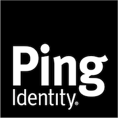

<!--
Copyright (c) 2025 ForgeRock. All rights reserved.

This software may be modified and distributed under the terms
of the MIT license. See the LICENSE file for details.
-->

<p align="center">
  <b>Identity Management (End User) - UI</b>
  
  <p align="center">
    The End-User UI is no longer included in PingIDM 8.0 and later. Follow the documentation and guidance in this README.
    <br>
  <p align="center">
    Easy to integrate, standalone UI to demonstrate ForgeRock Identity Management.
    <br>
  <a href="https://docs.pingidentity.com/pingidm/7.5/release-notes/preface.html"><strong>Explore ForgeRock docs »</strong></a> 
  </p>
  <p align="center">
    The purpose of this readme is to help users set up a self-contained development environment for the End-User UI that can be customized and expanded.
  </p>
</p>

- [Project setup](#project-setup)
  - [Compiles and hot-reloads for development](#compiles-and-hot-reloads-for-development)
  - [Compiles and minifies for production](#compiles-and-minifies-for-production)
  - [Run your unit tests](#run-your-unit-tests)
  - [Development server](#development-server)
  - [Development server tools](#development-server-tools)
  - [Application structure](#application-structure)
  - [Application tools](#application-tools)
  - [Translations and Text](#translations-and-text)


<a name="project-setup"></a>

## Project setup
If you haven't installed the node packages, you can run it from inside this folder, it will climb up to the top level and install everything appropriately.

```
yarn install
```

### Compiles and hot-reloads for development
```
yarn dev
```

### Compiles and minifies for production
```
yarn build
```

### Run your unit tests
```
yarn unit
```

<a  name="development-server"></a>

## Development server
`yarn dev` starts up a standalone node server primarily for ease of development. This development server also provides an easy way to test and understand various identity management features.
- Uses port `8889` by default, and auto-increments the port if `8889` is not available
- Assumes `openidm` is the context for the rest service (e.g. http://localhost:8080/openidm/info). If this is not the case, change the `VUE_APP_IDM_URL` environment variable in the `.env` file.
- Supports hot reloading and error display when code is changed
- Includes its own [testing](#testing)
- Built off [Vue CLI 5](https://cli.vuejs.org/config/)


<a name="development-server-tools"></a>

## Development server tools
- [Node](https://nodejs.org/en/download/) - Version 14.0.0 or newer
- [yarn](https://yarnpkg.com/) - Version 3.6.1


<a  name="application-structure"></a>

## Application structure

To help you with navigation, the application has the following basic layout:


```

public/

├── favicon.ico - Website fav icon

├── index.html - Application index.html

src/

├── api/ - General application api calls

├── components/ - General application components

├── composables/ - General application composables functions

├── scss/ - SCSS / CSS styling files

├── store/ - Shared data sources for components

├── locales/ - Translation files

├── utils/ - Variety of support components that are used throughout the application

├── views/ - General view components

├── i18n - Translation loader

├── router - Application routes

├── App.vue - The base application Vue component

└── main.js - Initialization Javascript file

│

vue.config.js - Vue CLI configuration File

│

Package.json - Node package JSON for dependency management

```

<a  name="application-tools"></a>

## Application tools

The following application tools are installed when you install the project dependencies:

- [Vue](https://vuejs.org/api/) - Primary Javascript framework for the project

- [Vue Router](https://router.vuejs.org/api/) - Application routing Vue library

- [Vue Bootstrap](https://bootstrap-vue.org/docs/components/) - Bootstrap 4 Vue components

- [Axios](https://github.com/axios/axios) - Javascript Promise Library

- [Vue i18n](https://kazupon.github.io/vue-i18n/) - Translation library for Vue

- [Vee Validate](https://github.com/baianat/vee-validate) - Form validation for Vue

- [lodash](https://lodash.com/) - Util library for preforming various efficient calculations


There are several other libraries included with both node and the application, but these are the primary core libraries used throughout. For additional libraries, see package.json `/package.json`


<a  name="translations-and-text"></a>

## Translations and Text

Application translation uses [Vue i18n](https://kazupon.github.io/vue-i18n/en/) and the `openidm/info/uiconfig` endpoint to get the current user's browser language.

The project only contains `en` based translations and falls back to `en` if an unsupported language is detected. To change the default language fallback adjust VueI18n `/src/main.js`.

Adding and changing an existing message for the `en` base language involves either adding a key or editing an existing key.

Keys follow JSON structure; for example, if you wanted to edit the navigation bar `Profile` to `User Profile` you would need to locate the appropriate key `en.sideMenu.profile` and change the text.

Inside of your Vue application you would then make use of that key with the built in translation function `{{$t('sideMenu.profile')}}` or `this.$t('sideMenu.profile')`.


Adding a new translation language means creating a new translation file inside of locales folder with a key matching the translation language code.

For example:


```

en.json

fr.json

gr.json

```

Then creating a JSON key structure that should be mirrored across all of the language files.


For example:

``` JSON
{
  dashboard: {
    welcomeMessage:  'Welcome!'
  }
}
```

<a name="deployment"></a>
## Deployment

- To deploy the application, run: `yarn build`

Running `yarn build` creates a distribution file in the `dist` folder and two detail files for support or QA purposes: `COMMITHASH` and `VERSION`. Each deployment use case is different.

<a name="theming"></a>
## Theming

The following theming tools are installed when you install the project dependencies:

- [SCSS](https://sass-lang.com/) - CSS enhancement library
- [Bootstrap 4.0](https://getbootstrap.com) - CSS Styling framework

<a name="build-command-summary"></a>
## Build command summary

``` bash
# install dependencies
yarn install

# serve with hot reload at localhost:8889 (increments by 1 automatically if port is in use).
yarn dev

# build for production with minification
yarn build

# run all tests
yarn unit
```

<a name="browser-support"></a>
## Browser support

- Latest Firefox
- Latest Safari
- Latest Chrome
