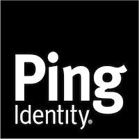

<!--
Copyright (c) 2020 ForgeRock. All rights reserved.

This software may be modified and distributed under the terms
of the MIT license. See the LICENSE file for details.
-->
<div align="center">
  
  <h1>Ping Identity Platform EndUser</h1>
  EndUser Application for the Ping Identity Platform.
  <p>
</div>

- [Project setup](#project-setup)
  - [Compiles and hot-reloads for development](#compiles-and-hot-reloads-for-development)
  - [Compiles and minifies for production](#compiles-and-minifies-for-production)
  - [Run your tests](#run-your-tests)
  - [Lints and fixes files](#lints-and-fixes-files)
  - [Run your unit tests](#run-your-unit-tests)
- [Application structure](#application-structure)
- [Application tools](#application-tools)
- [Translations and Text](#translations-and-text)
- [Theming](#theming)
- [Browser support](#browser-support)
- [Environment variables](#environment-variables)


## Project setup
If you haven't installed the node packages, you can run it from inside this folder, it will climb up to the top level and install everything appropriately.

```
yarn install
```

### Compiles and hot-reloads for development
```
yarn dev
```

### Compiles and minifies for production
```
yarn build
```

### Run your unit tests
```
yarn unit
```

### Run your e2e tests against the local UI backed by a platform deployment

```
yarn e2e
```

Ensure platform-login is currently running under 8083 in a separate terminal
Ensure localhost 8888 is not currently reserved under a separate terminal

### Run your e2e tests against a remote UI that's part of a platform or ID cloud environment

```
yarn e2e:remote
```

### Lints and fixes files
```
yarn lint
```

<a  name="application-structure"></a>

## Application structure


To help you with navigation, the application has the following basic layout:


```

tests/ - Folder containing the application tests

│

public/

├── static/ - Images and files that will not be processed by webpack

├── favicon.ico - Website fav icon

├── index.html - Application index.html

src/

├── components/ - General application components

│ ├── access/ - Delegated admin components

│ ├── dashboard/ - Dashboard widgets

│ ├── profile/ - Profile management components (KBA, profile edit, etc.)

│ ├── uma/ - User Managed Access integration

│ ├── utils/ - Variety of support components that are used throughout the application

│ ├── NotFound.vue/ - 404 page

│ └── OAuthReturn.vue/ - Handles OAuth returns for registration and login

├── assets - Images that will be processed by webpack

├── router - Application routes

├── i18n - Translation loader

├── scss/ - SCSS / CSS styling files

├── store/ - Shared data sources for components

├── locales/ - Translation files

├── App.vue - The base application Vue component

└── main.js - Initialization Javascript file

│

vue.config.js - Vue CLI configuration File

│

Package.json - Node package JSON for dependency management

```


<a  name="application-tools"></a>

## Application tools


The following application tools are installed when you install the project dependencies:


- [Vue](https://vuejs.org/v2/api/) - Primary Javascript framework for the project

- [Vue Router](https://router.vuejs.org/en/) - Application routing Vue library

- [Vue Bootstrap](https://bootstrap-vue.js.org/) - Bootstrap 4 Vue components

- [Axios](https://github.com/axios/axios) - Javascript Promise Library

- [Vue i18n](https://kazupon.github.io/vue-i18n/en/) - Translation library for Vue

- [Vee Validate](https://github.com/baianat/vee-validate) - Form validation for Vue

- [lodash](https://lodash.com/) - Util library for preforming various efficient calculations


There are several other libraries included with both node and the application, but these are the primary core libraries used throughout. For additional libraries, see package.json `/package.json`


<a  name="translations-and-text"></a>

## Translations and Text


Application translation uses [Vue i18n](https://kazupon.github.io/vue-i18n/en/) and the `openidm/info/uiconfig` endpoint to get the current user's browser language.


The project only contains `en` based translations and falls back to `en` if an unsupported language is detected. To change the default language fallback adjust VueI18n `/src/main.js`.


Adding and changing an existing message for the `en` base language involves either adding a key or editing an existing key.

Keys follow JSON structure; for example, if you wanted to edit the navigation bar `Profile` to `User Profile` you would need to locate the appropriate key `en.sideMenu.profile` and change the text.

Inside of your Vue application you would then make use of that key with the built in translation function `{{$t('sideMenu.profile')}}` or `this.$t('sideMenu.profile')`.


Adding a new translation language means creating a new translation file inside of locales folder with a key matching the translation language code.


For example:


```

en.json

fr.json

gr.json

```

Then creating a JSON key structure that should be mirrored across all of the language files.


For example:

``` JSON
{
  dashboard: {
    welcomeMessage:  'Welcome!'
  }
}
```

<a  name="theming"></a>

## Theming


The following theming tools are installed when you install the project dependencies:


- [SCSS](https://sass-lang.com/) - CSS enhancmenet library

- [Bootstrap 4.0](https://getbootstrap.com) - CSS Styling framework


Theming makes use of two concepts:


- Theming follows the basic [Bootstrap theming guidelines](https://getbootstrap.com/docs/4.0/getting-started/theming/) and relies on SCSS variable overrides.

- The theme file is loaded with an optional flag when running the dev server or distribution build. For example, `npm run dev --theme=red` or `npm run build --theme=red`.


When you include the theme flag, the `node` build scripts attempt to locate a corresponding file in `src/scss`. The file must also contain a `-theme.scss` moniker, for example, `red-theme.scss`.


The default project includes three themes:

- Ping Identity default theme

- Ping Identity dark theme `npm run --theme=dark`

- Ping Identity rock theme `npm run --theme=rock`. This theme demonstrates how to use a full background image, with fallback to the default theme.


<a name="browser-support"></a>

## Browser support


- Latest Firefox

- Latest Safari

- Latest Chrome


<a name="environment-variables"></a>

## Environment variables

Currently environment variables are:

1. VUE_APP_AM_URL - URL to be used by default for authentication
2. VUE_APP_AM_ADMIN_URL - URL for the location of the AM admin UI
3. VUE_APP_IDM_URL - URL of AM instance that will be used for administration
5. VUE_APP_ADMIN_URL - URL for the location of the admin UI
6. THEME - Will load a corresponding theme.scss file (example dark-theme.scss).
7. VUE_APP_ENDUSER_CLIENT_ID - defaults to 'end-user-ui'

These are made available in the .env file, and overridden by system environment variables in the .env.production file for dockerization.

Access in Vue files:

```
process.env.VUE_APP_AM_URL
process.env.VUE_APP_AM_ADMIN_URL
process.env.VUE_APP_IDM_URL
process.VUE_APP_ADMIN_URL
process.env.VUE_APP_ENDUSER_CLIENT_ID
process.env.THEME
```
